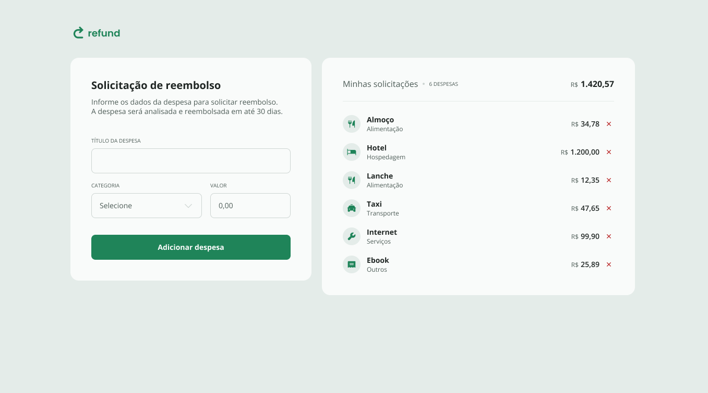

# Sistema de Reembolso de Despesas

___

Uma aplicação web intuitiva e eficiente para o registro e acompanhamento de despesas reembolsáveis. O sistema permite que os usuários declarem custos, categorizem suas despesas e acompanhem o total acumulado de maneira clara e prática.

---

## Sobre o Projeto

O **Sistema de Reembolso de Despesas** foi desenvolvido para facilitar o processo de registro e monitoramento de gastos realizados por usuários que precisam solicitar reembolso. O projeto demonstra habilidades em manipulação de formulários, gerenciamento de listas dinâmicas e cálculos em tempo real.

---

## Funcionalidades

- **Registro de Despesas:** O usuário pode inserir o nome da despesa, categoria e valor.
- **Lista Dinâmica:** Todas as despesas são exibidas em uma lista com as informações detalhadas.
- **Cálculo Automático:** 
  - O total de gastos é calculado automaticamente.
  - A quantidade total de despesas registradas é exibida na parte superior da lista.
- **Interface Amigável:** Design simples e responsivo, adequado para diferentes dispositivos.
- **Gerenciamento Prático:** Permite fácil acompanhamento e controle das despesas reembolsáveis.

---

## Tecnologias Utilizadas

- **HTML5:** Estruturação semântica da aplicação.
- **CSS3:** Estilização e responsividade.
- **JavaScript:** Lógica de interação e manipulação dinâmica dos dados.

---

## Demonstração do Projeto

Confira abaixo uma prévia do layout do projeto:

---

Feito com :heart: por Tiago Marques.
